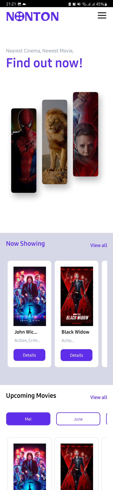
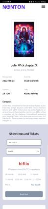
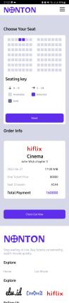
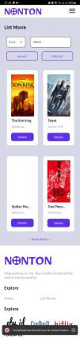

# <h1 align="center">**Nonton Mobile Ticketing**</h1>

<center>

<p><b>Nonton is an online movie ticket booking software that displays schedules, movies and ticket bookings where customers can purchase their movie tickets directly using the internet and pay through online banking.</b></p>

</center>
<br/>

<br/>

<p align="center">

<br />
<br />

</p>

<br/>
<hr/>

<!-- <span style='font-size:20px;'>&#128204;</span> -->

## **Contents**

<br/>

- [**Instalation**](#instalation)

- [**What To Do**](#what-to-do)

- [**Feature Desc**](#feature-desc)

- [**Preview**](#preview)

- [**Download**](#Download)

<br/>
<hr/>

## **Instalation**

<br/>

1. Clone this repository

   ```bash
   $ git clone https://github.com/irvanmnwr/tickits_mobile
   ```

2. Open Project Folder

   ```
   $ cd tickits_mobile
   ```

3. Instal Depedencies

   ```
   $ npm install
   ```

4. Add .env

   ```
    URL_BACKEND:

    CLAUDINARY:

   ```

5. Run the Project
   ```
   $ npm react-native run-android
   ```

<br/>
<hr/>

## **What To Do ?**

<br/>

1. Register using your real information
2. Open your registered email address
3. Open email and follow the instruction to verify your account
4. Login and use all of the feature in **Nonton**

<br/>
<hr/>

## **Feature Desc**

### <span style='font-size:15px;'>&#10032;</span> when booking seat, Nonton provides the following features:

- Feature Search film,
- Feature sort employee based on word A - Z or Z - A,
- Feature select schedule by location and time,
- Feature select seat based on schedule,
- Feature Pay order via e-banking.

### <span style='font-size:15px;'>&#10032;</span> Edit Profile, Nonton provides the following features:

- select image use camera or upload in library,
- Update Profile and Password,
- See order history,

<br/>
<hr/>

## **Preview**

<p align="justify">





</p>

<br/>
<hr/>

## **Deploy**

### **Enjoy your journey with tickits_mobile** >> Download Link : [**tickits_mobile**](https://drive.google.com/file/d/1pydeV76Br6jNadm0bf7XyCHmaDRUc7km/view?usp=sharing)

<br/>
<hr/>                                                                                                                                                                                                                               |
